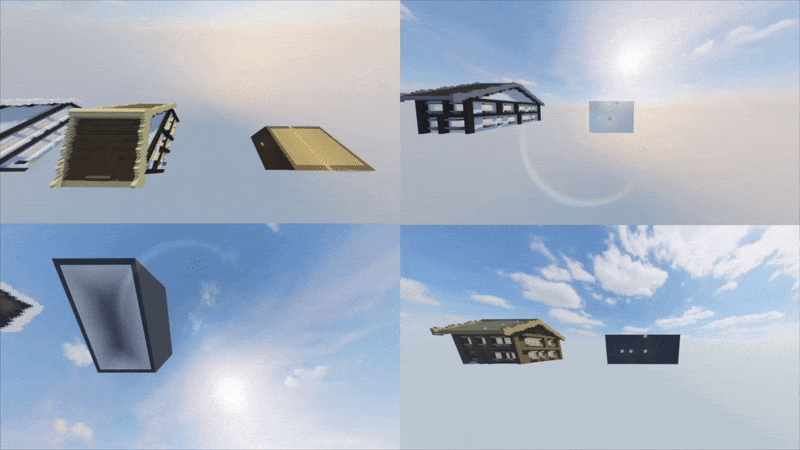
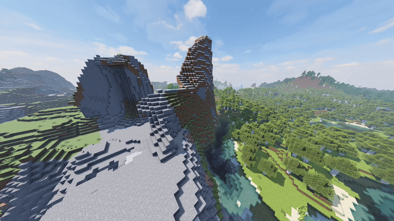

# Minecraft Procedural Village Generator

Procedural village generation system built in Python for Minecraft using the MCPI API.
Generates terrain-aware villages with houses, paths, and landscaping based on world geometry.

## Features

- Procedural generation of multiple houses with recursively generated layouts, unique dimensions and fancy roofs.

- Terrain-aware placement with biome specific terraforming, blending houses into the terrain naturally.

- Pathfinding algorithm designed to connect all buildings in the village, with decorative structures and blending into the surrounding terrain.

## Technical Highlights

- Implemented spatial algorithms for structure placement and collision avoidance across uneven and hard-to-terraform terrain
- Designed a recursive house-generation algorithm with parameterised randomness for high structural variation

Designed pathfinding algorithm connecting all houses in a village.

Built terrain analysis and terraforming logic to adapt villages to mountains and slopes

Heres an extreme example:

Integrated with Minecraft via MCPI for real-time world manipulation

## Structure
village.py file is our programs 'main' file. Running the village.py file will run the program.

## Try it out yourself

1. Install dependencies:
`pip install mcpi numpy`

2. Start Local Minecraft server 

Set the world spawn point to 0, 0, 0 (/setworldspawn 0 0 0) in any world this program is run.  

3. Run Script:
'python village.py'

## Contributions
This project was developed as part of a 3-person team.